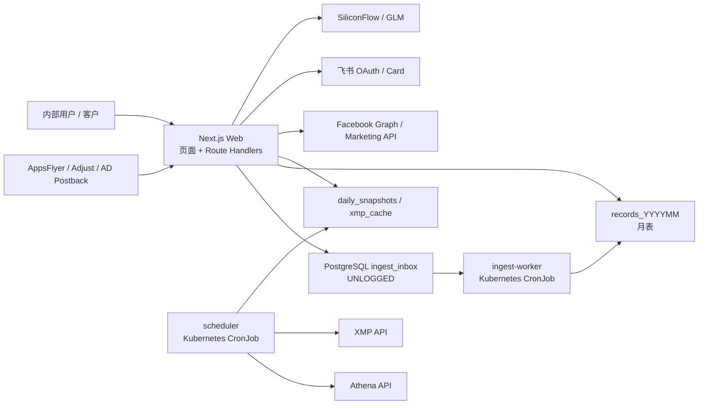

# Agentic UG 当前技术选型方案

> 文档状态：现状基线
>
> 盘点日期：2026-08-17
>
> 代码基线：`main`，`41208e66f29c9aa6a292383aaf0068f14198dcb9`
>
> 关联文档：[[01-current-product-structure|当前产品结构与前端现状]]、[[02-new-requirement-prd-template|新需求 PRD 模板]]

## 1. 结论摘要

Agentic UG 当前采用一套以 TypeScript 和 PostgreSQL 为中心的模块化单体架构：

| 技术域     | 当前选型                                     | 核心目的                                    |
| ---------- | -------------------------------------------- | ------------------------------------------- |
| 运行时     | Node.js 22                                   | 统一 Web、数据任务和工具的运行时            |
| 语言       | TypeScript 5.7，严格模式                     | 提前发现数据结构和空值问题                  |
| 包管理     | pnpm 11.7 workspace                          | 管理单体仓库和内部包依赖                    |
| Web        | Next.js 15 App Router + React 19             | 同时承载页面、内部 API 和 Postback 接收端   |
| 前端样式   | Tailwind CSS 4 + CSS 变量 + 少量 CSS Modules | 支持内部看板双主题和独立客户门户            |
| 图表与日期 | Chart.js 4 + Flatpickr 4                     | 延续看板图表与日期范围交互                  |
| 后端任务   | Node.js 有界 CLI Job                         | 将抓取、批写和迁移从 Web 进程分离           |
| 数据库     | PostgreSQL + `pg`，无 ORM                    | 统一存储并保留对 SQL 和旧业务口径的精确控制 |
| 数据缓冲   | PostgreSQL `UNLOGGED ingest_inbox`           | 解耦高频 Postback 接收与月表批量写入        |
| 调度       | Kubernetes CronJob                           | 避免多副本 Web 内重复执行定时任务           |
| 容器平台   | 阿里云 ACK                                   | 承载 Web Deployment 和周期 Job              |
| 发布方式   | Jenkins 构建镜像 + Helm/ArgoCD GitOps        | 应用代码与部署声明分仓管理                  |
| 内部鉴权   | 飞书 OAuth + 卡片确认 + HMAC Cookie          | 对接组织身份并适配无状态多副本              |
| AI         | SiliconFlow OpenAI 兼容接口 + GLM            | 提供流式投放建议                            |

这个方案的首要目标不是追求最新架构，而是：

1. 保持旧生产业务口径不变。
2. 把 Python、Express、Shell 和多存储收敛为一套主要技术栈。
3. 让 Web 与所有 Job 使用同一版本代码。
4. 在不额外引入 Redis、消息队列和 ORM 的前提下降低运维复杂度。

## 2. 架构形态



整体属于“模块化单体 + 外置有界 Job”：

- 一个 pnpm workspace 保存 Web、Job 和共享库。
- 一个 PostgreSQL 实例保存明细、快照、缓存、鉴权和广告管理数据。
- Web 是常驻进程；抓取、批写、迁移和补标签是运行后退出的 CLI。
- 线上使用同一个应用镜像，通过不同启动命令运行 Web 或 Job。

## 3. 运行时与语言

### 3.1 Node.js 22

项目将 Node 锁定为 `>=22 <23`，`.nvmrc` 同样指向 22。选择 Node 22 的原因：

- 使用当前 LTS 运行时。
- 原生提供稳定的 `fetch`、Web Streams、`AbortController` 和现代 ESM 能力。
- Web、抓取器和 CLI Job 可以共用语言、类型与工具链。
- 容器和本地开发版本保持一致。

项目不支持用 Node 24 作为正式开发或构建基线。

### 3.2 TypeScript 5.7

全仓采用 TypeScript，并打开高强度编译约束：

- `strict`
- `noUncheckedIndexedAccess`
- `exactOptionalPropertyTypes`
- `noPropertyAccessFromIndexSignature`
- `noImplicitReturns`
- `noUnusedLocals` / `noUnusedParameters`
- `verbatimModuleSyntax`
- `isolatedModules`

编译目标为 ES2023，全仓 ESM。共享包和服务使用 `tsc -b` 生成 `dist`；Next.js 应用只做类型检查，不由 `tsc` 输出文件。

需要注意两套模块解析规则：

- `packages/*` 和 `services/*` 最终由 Node 直接运行，跨文件相对导入带 `.js`。
- `apps/web` 交给 Next.js bundler，源码相对导入不能带 `.js`。

## 4. 单体仓库与依赖管理

### 4.1 pnpm workspace

工作区只包含：

```text
apps/*
services/*
packages/*
```

内部依赖通过 `workspace:*` 和包名引用，例如 `@agentic-ug/db`，不使用跨目录相对路径。依赖方向固定为：

```text
apps / services → packages
```

当前共享包包括：

| 包                    | 职责                                         |
| --------------------- | -------------------------------------------- |
| `@agentic-ug/core`    | 字段抽取、月表推导、修正系数和共享类型       |
| `@agentic-ug/db`      | PostgreSQL Pool、查询封装和幂等 Schema       |
| `@agentic-ug/fetcher` | Athena、XMP、DAU、素材及 Facebook API 客户端 |

### 4.2 不采用微服务拆仓

当前没有把每个能力拆成独立仓库或独立发布单元，原因是：

- Web 和 Job 需要共享业务口径。
- 团队需要降低版本漂移和联调成本。
- 线上要求 Web 与 Job 运行同一版本代码。
- 当前规模下，包级边界已经能提供足够的职责隔离。

## 5. Web 与前端选型

### 5.1 Next.js 15 App Router

`apps/web` 使用 Next.js App Router，同时承担：

- React 页面渲染。
- `/api/*` Route Handlers。
- AppsFlyer、Adjust 等 Postback 接收端。
- 登录回调与健康检查。
- 客户门户和公开协同页面。

采用 Next.js 的主要原因是将旧 Express 看板和 FastAPI HTTP 端点收敛到一个 Web 运行时，同时保留服务端路由、Cookie 和流式响应能力。

关键配置包括：

- `output: 'standalone'`，仓库自身支持生成精简服务端产物。
- `serverExternalPackages` 外置 `pg` 与飞书 SDK。
- `outputFileTracingRoot` 指向 monorepo 根目录。
- 显式追踪运行时读取的 Prompt Markdown。
- Rewrite 兼容旧 `/appsflyer`、`/adjust` 和 `/mia` 路径。

### 5.2 React 19

旧看板的原生 JavaScript SPA 已迁移为 React 客户端组件。当前组件组织以业务面板为主，状态管理使用 React 自带能力：

- `useState` / `useEffect` / `useMemo` / `useCallback`。
- 页面级状态放在各面板组件内部。
- 主题、账户选择和客户偏好使用 `localStorage`。
- 主站面板通过 History API 维护路径。

当前没有引入 Redux、Zustand、TanStack Query 或 SWR。这样减少了依赖和迁移复杂度，但也使数据请求、缓存、错误状态和超大组件拆分主要依赖手工约定。

### 5.3 样式系统

内部主站采用：

- Tailwind CSS 4。
- CSS 自定义属性作为颜色、阴影和圆角令牌。
- `data-theme` 驱动明暗主题。
- `globals.css` 处理全局样式及 Flatpickr 第三方样式覆盖。

客户门户 `/demo` 使用独立 CSS Module；`/mia` 仍是自包含 HTML/CSS/JavaScript。当前没有引入组件库或统一 Design System，因此三个产品面的视觉实现和组件复用相互独立。

### 5.4 图表与日期

- 主看板图表使用 Chart.js 4。
- 客户门户部分趋势图使用组件内 SVG 手工渲染。
- 日期范围选择使用 Flatpickr 4，并提供中文本地化。

这种组合保留了原看板的交互和视觉，但形成了两种图表实现方式。

### 5.5 前端数据访问

浏览器端使用原生 `fetch` 和少量本地封装：

- 默认携带 Cookie 会话。
- 部分请求使用 `AbortController` 实现超时。
- LLM 和 XMP 回填通过 Web Streams/NDJSON 实现流式反馈。
- DTO 由 TypeScript interface 描述。

当前没有统一的运行时 Schema 校验库。很多 API Body 直接做 TypeScript 类型断言，类型只能约束编译期，不能保证线上输入结构。

## 6. 后端与任务选型

### 6.1 Route Handler + 业务模块

HTTP 层使用 Next.js Route Handler，约定：

- Route 文件负责鉴权、参数读取和 Response。
- 看板计算放在 `apps/web/src/lib/dashboard/*`。
- 广告平台操作放在 `apps/web/src/lib/dashboard/ad/*`。
- 外部集成能力优先放在共享 `packages/fetcher`。

项目没有继续使用 Express、FastAPI 或 NestJS，也没有引入 RPC 框架。

### 6.2 有界 Node.js CLI Job

可执行服务采用“跑完退出”或“到时退出”的 Node CLI：

| 服务                  | 运行形态            | 职责                                   |
| --------------------- | ------------------- | -------------------------------------- |
| `scheduler`           | 每整点运行一次      | 拉取 Athena、XMP、素材、修正系数和 DAU |
| `ingest-worker`       | 默认最多运行 2 分钟 | 批量消费 `ingest_inbox`                |
| `tag-payment-channel` | 每小时运行一次      | 为 AD 购买事件补支付渠道               |
| `migrate`             | 人工/部署时执行     | 幂等创建和演进数据库 Schema            |
| `import-json`         | 一次性工具          | 导入旧 JSON 快照                       |

选择有界 Job 而非 Web 进程内定时器的原因：

- Web 多副本时进程内定时器会重复执行。
- Job 需要明确退出和失败状态。
- Kubernetes CronJob 可以独立配置重试、资源和时区。
- 数据库连接池可以在任务结束时显式关闭。

## 7. 数据库与数据模型

### 7.1 PostgreSQL 单实例

当前所有主要存储统一到一个 PostgreSQL 实例：

- Postback 月表 `records_YYYYMM`。
- `user_lookup` 和 Athena 收入。
- 日快照、XMP 缓存、eLTV 缓存和抓取状态。
- 飞书用户与登录挑战。
- 客户门户账号。
- Facebook Token、账户、素材、Campaign、AdSet、Ad。

这个选择替代了旧系统同时使用 PostgreSQL、SQLite 和本地 JSON 文件的形态。好处是部署简单、跨进程共享状态直接，代价是数据库同时承担明细库、缓存、队列和业务配置等多种职责。

### 7.2 `pg` + 原生 SQL，无 ORM

数据库访问通过 `@agentic-ug/db` 的共享 Pool、`query` 和 `queryOne` 完成。SQL 使用 `$1` 参数化占位符。

不使用 ORM 的主要原因：

- 月表名称需要按日期动态推导。
- 大量查询从旧生产逻辑逐字迁移。
- PostgreSQL 表达式索引、JSONB、`SKIP LOCKED` 和批量 SQL 需要精确控制。
- 避免 ORM 改写查询后造成业务口径或性能漂移。

代价是类型映射、输入校验、迁移顺序和复杂 SQL 的测试都需要项目自行负责。

### 7.3 幂等 DDL，无迁移框架

Schema 集中在 `packages/db/src/schema.ts`，由 `services/migrate` 执行 `CREATE TABLE IF NOT EXISTS`、`ALTER TABLE` 和数据回填。当前没有 Prisma、Drizzle、Knex migration 或版本化 SQL migrations。

优点是依赖少、可重复执行；风险是缺少正式迁移版本、回滚记录和严格的迁移顺序管理。涉及破坏性表结构变化时，需要额外设计备份和回滚方案。

### 7.4 JSONB 与结构化表并用

为了复刻旧系统，快照和缓存优先以 JSONB 保存原结构：

- `daily_snapshots`
- `xmp_cache`
- `eltv_cache`
- `fetch_status`

广告管理对象则使用结构化表，并用 `channel_extra JSONB` 保存平台特有字段。这是一种“稳定公共字段结构化，快速变化字段 JSONB 化”的折中。

### 7.5 手工月表

高量 Postback 数据按月进入 `records_YYYYMM`。跨月查询通过 `getTablesForRange` 生成 `UNION ALL`，没有采用 PostgreSQL 原生声明式分区。

这样能保持旧表结构和查询语义，但每个新查询都必须正确处理跨月、表不存在和北京时间/UTC 边界。

## 8. Postback 读写解耦

### 8.1 当前方案

Postback Route Handler 不直接写索引较重的月表，而是：

1. 解析 Query、Form 或 JSON Body。
2. 抽取统一字段。
3. Append 到 `UNLOGGED ingest_inbox`。
4. `ingest-worker` 使用事务和 `FOR UPDATE SKIP LOCKED` 批量删除并写入月表。
5. 同一事务内派生 `user_lookup`。
6. 写入失败时回滚，数据留在 Inbox 供后续重试。

### 8.2 为什么选 PostgreSQL Inbox

曾考虑但未采用：

| 方案                      | 结论     | 原因                                                   |
| ------------------------- | -------- | ------------------------------------------------------ |
| Next.js 进程内队列        | 否决     | 多副本队列相互隔离，重启丢失且难以单例消费             |
| Redis List                | 暂不引入 | 增加一套基础设施，当前尚未证明 PostgreSQL Inbox 是瓶颈 |
| Route Handler 直接写月表  | 否决     | 高并发回传会承担多个索引和派生逻辑，影响接收延迟       |
| PostgreSQL UNLOGGED Inbox | 当前采用 | 复用现有数据库、写入快、支持事务消费和跨进程共享       |

`UNLOGGED` 表在 PostgreSQL 异常重启后可能丢失数据，这是为降低写开销而接受的明确取舍，与旧系统队列满时允许丢弃的语义一致。

## 9. 鉴权与安全选型

### 9.1 内部主站

内部主站采用：

- 飞书 OAuth 获取稳定 `open_id`。
- 飞书交互卡片二次确认。
- PostgreSQL 保存用户目录和一次性挑战。
- HMAC 签名、HttpOnly、SameSite=Lax 的无状态 Cookie。
- OAuth `state` 签名 Cookie 防止 CSRF。
- Cookie 7 天有效，显式 `SESSION_SECRET` 优先。

选择无状态 Cookie 是为了让多个 Web 副本共享登录态，不依赖进程内 Session Store。

### 9.2 投放操作权限

广告管理 API 在登录之上增加角色校验：

- 飞书部门包含“投放”；或
- 邮箱前缀位于临时白名单。

用户资料缓存到 `ad_operator_profile`。这仍是 Demo 阶段的权限模型，尚未形成通用 RBAC、权限后台或审批流程。

### 9.3 客户门户

客户门户使用独立 Cookie、独立签名盐和独立账号表，避免外部客户会话与内部主站互通。

当前账号口令以明文保存在数据库，并存在默认演示账号。这只能视为演示阶段实现，不适合作为正式客户系统的长期方案。正式开放前应切换到密码哈希、强制初始化、登录限速和账号生命周期管理。

### 9.4 M2M 接口与接口保护

内部 API 支持 Session；历史 M2M 口令支持 Query Key 或 Bearer Token，但默认总闸关闭。接口保护包括：

- 日期硬范围。
- 每 IP 请求频率。
- 每 IP 和全局并发限制。
- 请求硬超时。

计数器保存在进程内，只对单副本严格有效。若 Web 扩成多副本，需要外部化到 Redis 或其他共享限流设施。

## 10. 外部平台集成

| 平台        | 用途                                             | 当前接入方式                               |
| ----------- | ------------------------------------------------ | ------------------------------------------ |
| Athena      | 产品总收入、新用户收入、PWA 提现                 | 服务端 HTTP API，每整点抓取                |
| AppsFlyer   | 购买、注册和归因回传                             | S2S Postback 到 Next.js                    |
| Adjust/AD   | 自有埋点和购买回传                               | S2S Postback 到 Next.js                    |
| XMP         | Facebook/Google/TikTok 投放消耗                  | Open API + PostgreSQL 缓存                 |
| Facebook    | Token、账户、素材、Campaign、AdSet、Ad、Insights | Graph/Marketing API 客户端                 |
| 飞书        | 内部身份、登录确认、联系人和卡片                 | 官方 Node SDK + Open API + 长连接          |
| SiliconFlow | AI 投放建议                                      | OpenAI 兼容 Chat Completions，SSE 流式代理 |
| DAU 服务    | 日报成本分摊相关数据                             | 服务端 HTTP 请求                           |

网络客户端主要使用 Node 原生 `fetch` 或 `node:https`，通过 `AbortController`/请求超时、重试和限速处理上游不稳定。当前没有统一的 HTTP Client、熔断器或分布式限流组件。

## 11. 缓存与并发控制

系统采用多层轻量缓存：

- PostgreSQL `daily_snapshots` 保存按日定稿数据。
- PostgreSQL `xmp_cache` 保存 XMP 结果和抓取时间。
- PostgreSQL `eltv_cache` 保存拟合结果。
- Web 进程内保存部分范围查询缓存、API 限流和 XMP 调用节流状态。
- 客户门户将聚合结果写入 PostgreSQL Cache。

当前未引入 Redis。这个方案适合单副本或少量副本，但进程内缓存、限流和冷却状态在多副本间不会同步。

## 12. AI 选型

AI 投放建议使用 SiliconFlow 的 OpenAI 兼容接口，默认模型配置为 `zai-org/GLM-5.1`。

实现特点：

- Prompt 以 Markdown 文件保存在 `apps/web/prompts`。
- 后端根据投手、产品和渠道生成上下文。
- Route Handler 将 Chat Completions 的 SSE 流透传给浏览器。
- 模型、Base URL 和 API Key 均通过环境变量配置。

该设计降低了模型服务耦合，但目前未见统一的 Prompt 版本号、调用成本统计、质量评测集或脱敏治理。

## 13. 构建、发布与部署

### 13.1 构建

- 使用 pnpm Lockfile 固定依赖。
- CI/镜像安装使用 `pnpm install --frozen-lockfile`。
- 共享包和服务通过 `pnpm -r build` 构建。
- Next.js 构建包含 TypeScript 校验，ESLint 独立执行。

### 13.2 线上镜像

线上不是使用仓库内的 `deploy/Dockerfile`。当前权威构建入口位于：

```text
jenkins-projects/projects/agentic-ug-demo/Dockerfile
```

线上镜像包含完整 monorepo，默认运行 `pnpm start`；CronJob 通过 `command` 覆盖为 `pnpm job:*`。这样 Web 与所有 Job 使用同一份代码。

仓库内 `deploy/Dockerfile` 是重构期遗留，只能用于理解旧构建思路，不能作为线上变更依据。

### 13.3 GitOps

Kubernetes 资源不在本仓库维护，而是在 `dora-k8s-config` 中由 Helm 声明，并通过 ArgoCD 部署到 ACK。镜像 Tag 由 Jenkins 写入 `jenkins-k8s-values`。

部署职责边界：

| 仓库               | 职责                                                |
| ------------------ | --------------------------------------------------- |
| Agentic-UG-Demo    | 应用代码、包和启动脚本                              |
| jenkins-projects   | 生产镜像构建定义                                    |
| dora-k8s-config    | Deployment、CronJob、环境变量、资源和数据库 Feature |
| jenkins-k8s-values | Jenkins 更新的镜像 Tag                              |

生产密钥通过 Kubernetes Secret 和 `features.databases` 注入，不进入 Git。

## 14. 工程质量选型

### 14.1 ESLint

ESLint 9 使用 Flat Config，组合：

- `@eslint/js` recommended。
- `typescript-eslint` strict type-checked。
- `typescript-eslint` stylistic type-checked。
- `eslint-plugin-import`。
- `eslint-plugin-unicorn`。
- `eslint-config-prettier`。

关键规则包括 Import 分组与排序、类型导入、循环依赖禁止和严格的未使用变量检查。

### 14.2 Prettier

格式化由 Prettier 单独负责，核心配置为：

- 单引号。
- 分号。
- 100 字符行宽。
- 尾逗号。
- LF。

全仓 `format:check` 当前存在历史失败，实际提交应只格式化和检查本次修改的文件。

### 14.3 自动化门禁现状

仓库目前没有 `.github/workflows`，也没有发现项目自身的单元测试、组件测试或端到端测试配置。当前主要门禁依赖开发者提交前手工执行：

```text
pnpm lint
pnpm typecheck
pnpm build
Prettier 检查改动文件
```

这是当前技术方案中最明显的工程风险之一。

## 15. 可观测性与运维

当前具备：

- `/health` 健康检查。
- `fetch_status` 保存抓取状态。
- Job 使用结构化程度有限的 `console.log/warn/error`。
- API Guard 记录超时、限流和并发状态。
- XMP 缺数、缓存过期和抓取失败会在页面或日志中暴露。
- 广告操作有局部 Trace ID 和日志封装。

当前未见统一接入的 OpenTelemetry、Sentry、Prometheus 指标或集中式业务审计系统。日志、指标和告警仍主要依赖平台日志及业务页面提示。

## 16. 已否决或暂缓的技术方案

| 方案                               | 当前结论 | 主要原因                                   |
| ---------------------------------- | -------- | ------------------------------------------ |
| Python FastAPI + Node Express 双栈 | 已替换   | 业务重复、部署复杂、类型和代码无法共享     |
| Web 进程内定时器                   | 已替换   | 多副本重复执行，生命周期不稳定             |
| 多数据库 + 本地 JSON               | 已替换   | 数据割裂、迁移和备份复杂                   |
| ORM                                | 未采用   | 需要精确 SQL、动态月表和旧口径复刻         |
| Redis Queue                        | 暂缓     | 尚未证明 PG Inbox 是瓶颈，避免新增基础设施 |
| 独立消息队列                       | 暂缓     | 当前吞吐和团队规模尚不需要                 |
| 全局前端状态库                     | 未采用   | 当前以页面局部状态为主，减少迁移依赖       |
| 前端组件库                         | 未采用   | 现有页面延续自定义看板视觉                 |
| API Runtime Schema 库              | 未采用   | 当前主要依靠 TS 类型和手工校验             |

## 17. 当前技术债与风险

按优先级建议关注：

### P0：安全与线上风险

1. 客户门户账号仍使用数据库明文口令和默认演示账号。
2. Facebook Token/App Secret 存在业务表中，需要确认数据库访问隔离、加密和审计策略。
3. `/api/mia` 当前公开，内部负责人和投放数据存在暴露风险。
4. 缺少正式 RBAC；投放操作依赖部门关键词和硬编码邮箱白名单。

### P1：质量与可维护性

1. 没有自动化 CI 和测试体系。
2. API 输入缺少统一运行时 Schema 校验。
3. 数据库迁移没有版本化框架和自动回滚。
4. 多个前端面板文件超过 500 行，页面状态、请求和渲染耦合较重。
5. 内部主站、客户门户和协同中心使用三套前端实现。
6. README、重构文档和生产部署事实存在部分过期或冲突。

### P2：扩展能力

1. API 限流、范围缓存和 XMP 冷却为进程内状态，多副本不一致。
2. PostgreSQL 同时承担业务库、缓存和队列，增长后需要容量与延迟基线。
3. 手工月表增加跨月查询和时区错误风险。
4. 外部 HTTP 调用没有统一客户端、熔断和全链路 Trace。
5. AI 缺少 Prompt 版本管理、离线评测和成本监控。

## 18. 后续技术选型原则

新增需求默认遵循以下原则：

1. **业务口径优先**：不因框架或抽象便利修改既有公式、去重或匹配逻辑。
2. **沿用模块化单体**：除非存在明确的独立扩缩容、故障隔离或团队边界，不新增微服务。
3. **优先复用现有 PostgreSQL**：但新增高吞吐队列或跨副本状态前先给出压测和容量依据。
4. **Web 不承载周期调度**：周期任务继续使用有界 Job + Kubernetes CronJob。
5. **业务逻辑不进入 Route Handler**：路由只做协议适配，逻辑落到 `lib` 或共享包。
6. **新接口必须有运行时校验**：建议逐步引入统一 Schema，而不是继续扩大类型断言。
7. **高风险操作必须可审计**：预算、启停、Token、删除和批量操作要记录操作人、旧值、新值和结果。
8. **新前端优先收敛设计系统**：避免再增加第四套视觉令牌和基础组件。
9. **生产事实以外部 GitOps 仓库为准**：本仓库不新增 Kubernetes Manifest，也不修改遗留 Dockerfile代替正式构建配置。
10. **新增共享基础设施要有证据**：Redis、消息队列、搜索引擎或微服务都应由吞吐、延迟、可靠性或组织边界驱动。

## 19. 建议的演进顺序

1. 先补安全基线：客户密码哈希、MIA 鉴权、Token 存储治理、通用 RBAC。
2. 建立最小 CI：lint、typecheck、build、改动文件格式检查。
3. 为核心口径、Postback 入库和广告操作补自动化测试。
4. 引入统一 API 输入 Schema，并从新接口开始执行。
5. 抽取内部前端基础组件和设计令牌，逐步拆分超大面板。
6. 建立统一日志、指标、Trace 和操作审计。
7. 基于真实容量数据决定是否引入 Redis、原生分区或独立队列。
